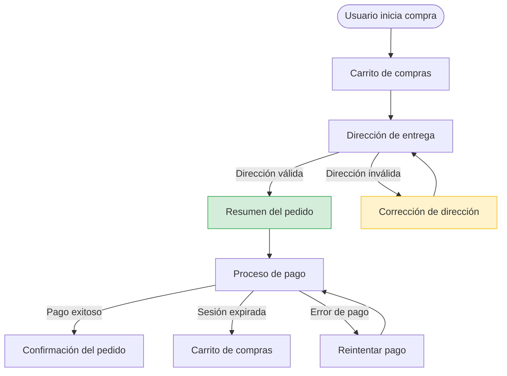

# Visual Flow Diagrams — Mermaid Guide

This reference defines when to generate flow diagrams, how to reconstruct flows from Flutter code, and which Mermaid syntax to use for stakeholder-readable output.

---

## When to include a flow diagram

Generate a Mermaid diagram for a module **only if at least one of these is true**:

| Trigger | Examples |
|---|---|
| A new screen or page was added | New `*_screen.dart`, `*_page.dart`, `*_view.dart` file committed |
| A new navigation route was registered | New entry in `app_router.dart`, `routes.dart`, `auto_router` config |
| An existing flow changed steps | Screen added/removed from a multi-step flow (e.g. onboarding, checkout) |
| A conditional branch was added/removed | New auth gate, permission check, or feature flag altering navigation |
| A new entry point was introduced | New bottom nav item, deep link, or notification tap destination |
| A module was restructured | Screens reordered, merged, or split |

**Do NOT generate a diagram for:**
- Bug fixes that restore the original behavior
- UI/visual tweaks with no navigation impact
- Performance improvements
- Hotfix releases (Template B) — skip the section entirely

---

## How to detect flow-impacting changes in Flutter

After extracting commits, run the following to find changed files:

```bash
git diff --name-only <previous_tag>..<new_tag>
```

Then filter for flow-relevant files:

```bash
git diff --name-only <previous_tag>..<new_tag> | grep -E \
  "(screen|page|view|route|router|navigation|nav|flow|wizard|onboarding)" -i
```

For each flagged file, inspect what changed:
```bash
git diff <previous_tag>..<new_tag> -- <file_path>
```

**Key signals to look for in diffs:**

| Flutter pattern | What it means |
|---|---|
| `@RoutePage()` or `@route` annotation added | New routable screen introduced |
| New entry in `AutoRoute(page: ...)` | Route registered in auto_router |
| `context.router.push(...)` or `context.go(...)` | Navigation action added or changed |
| New BLoC state with `navigateTo` or `pushRoute` | Flow-driven navigation from state |
| `Navigator.pushReplacement` or `popUntil` | Flow exit or reset point |
| `GoRoute(path: '...')` added | New go_router route |
| New `BottomNavigationBarItem` | New top-level section added |
| `if/else` blocks around navigation calls | Conditional branch in flow |

---

## Diagram rules for stakeholders

The audience is non-technical. Diagrams must be **intuitive at first glance**.

### Use `flowchart TD` (top-down)
This is the most readable format for user journeys.

```
flowchart TD
    A[Pantalla de inicio] --> B[Login]
    B -->|Credenciales correctas| C[Dashboard]
    B -->|Error| D[Mensaje de error]
    D --> B
```

### Node naming rules

| Rule | Example |
|---|---|
| Use screen names as the user sees them | ✅ `Inicio de sesión` ❌ `LoginScreen` |
| Use verbs for actions/decisions | ✅ `¿Tiene cuenta?` |
| Use present tense for states | ✅ `Perfil del usuario` |
| Keep labels short (3–5 words max) | ✅ `Confirmar pedido` ❌ `OrderConfirmationPage` |

### Node shapes by type

| Shape | Mermaid syntax | Use for |
|---|---|---|
| Rectangle | `[Nombre]` | Regular screen or state |
| Rounded | `(Nombre)` | Start or end point |
| Diamond | `{¿Condición?}` | Decision / branch |
| Stadium | `([Nombre])` | External trigger (notificación, deep link) |

### Edge labels

Add labels only when the branch reason isn't obvious from the nodes:
```
B -->|Éxito| C
B -->|Error de red| D
```

Avoid cluttering with labels on every single arrow.

### Highlighting new vs modified elements

When a diagram shows changes relative to the previous version, annotate with comments:

```
%% NUEVO en v2.3.0
A --> B
%% MODIFICADO: antes iba directo a C
B --> D --> C
```

This gives stakeholders a clear before/after sense without two separate diagrams.

---

## Diagram scope per module

Each module gets its **own diagram block** — do not combine unrelated modules into one diagram.

Keep diagrams focused: show the primary happy path + the most important branches. Do not try to show every possible edge case — that's what the code is for.

**Maximum recommended nodes per diagram: 10–12**  
If a flow is larger, split it into "main flow" and "sub-flow" diagrams.

---

## Full example — New checkout flow

Commits detected:
- `feat: add order summary screen before payment`
- `feat: add address validation step to checkout`
- `fix: redirect to cart when session expires during checkout`

Reconstructed flow diagram:



*Nota: La pantalla "Resumen del pedido" y el paso de validación de dirección son nuevos en esta versión.*

---

## Styling conventions

Use minimal color coding only when it helps distinguish:
- `fill:#d4edda,stroke:#28a745` — Green: new screen added in this release
- `fill:#fff3cd,stroke:#ffc107` — Yellow: existing screen with modified behavior
- No color (default): unchanged screen shown for context

Include a legend if colors are used:

```
%% 🟢 Verde: nuevo en esta versión  |  🟡 Amarillo: flujo modificado
```